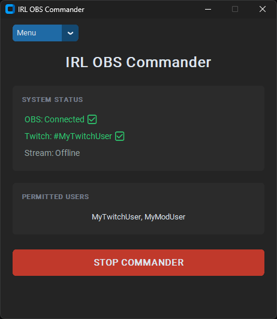
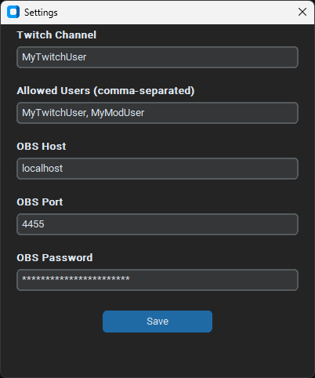

# IRL OBS Commander

A application that allows Twitch chat users to remotely control OBS (Open Broadcaster Software) streaming via IRC chat commands.

<table>
  <tr>
    <td>
      <p align="center"><b>Main Interface</b></p>
      
    </td>
    <td>
      <p align="center"><b>Settings Menu</b></p>
      
    </td>
  </tr>
</table>

## The IRL Streamer Use Case

This tool was specifically designed with **IRL (In Real Life)** streamers in mind. When you are streaming outdoors via an SRTLA server (like Belabox or OBS(N)), your OBS computer is often miles away at home.

- **Remote Scene Switching:** If your mobile signal drops or you want to switch from your "Camera" scene to a "BRB" screen, you can't simply walk over to your PC. With this tool, you or your moderators can switch scenes directly from Twitch chat.
- **Emergency Stops:** If something happens on camera that needs to be cut immediately, a quick `!stop` command in chat provides an instant safety net.
- **No Remote Desktop Needed:** Avoid the lag and hassle of trying to use TeamViewer or AnyDesk on a small phone screen while live.
- **Setup in Minutes:** No complex Twitch OAuth or bot accounts required. Enable OBS WebSocker, run the app, enter your Twitch channel, and you're ready to go.

## Features

- **Twitch Chat Integration**: Connects to Twitch IRC to monitor chat messages
- **OBS Control**: Start and stop streaming and change scenes directly from Twitch chat
- **User Access Control**: Only specified users can execute commands
- **Connection Monitoring**: Real-time GUI status indicators for both Twitch and OBS connections

## Installation & Setup

- Download the latest binary release from the [releases](https://github.com/Lewster2307/IRL-OBS-Commander/releases) page
- **Set up OBS WebSocket (requires OBS Studio version 28 or newer for built-in WebSocket support or install the [plugin](https://github.com/obsproject/obs-websocket/releases/tag/5.0.0) for older versions)**:
   - Tools > WebSockets Server Settings
   - Enable WebSockets server
   - Configure the server port (usually 4455) and password in OBS
- Start the IRL-OBS-Commander.exe to auto generate the `settings.dat` file
- Go to Menu > Settings to enter your Twitch channel name, allowed users, and OBS credentials.

> [!NOTE]  
> Because this is an unsigned standalone executable, Windows SmartScreen may show a warning. This is common for open-source tools. You can bypass this by clicking "More Info" > "Run Anyway". Alternatively, you can run the source code directly as explained in the [Setup for development](#setup-for-development) section or build your own executable as explained in the [BUILD.md](BUILD.md) file.

## Usage

### Interface

- **Waiting for commander to start:** App is idle and waiting for user to start the commander
- **OBS Status:**
  - **Connected:** Ready for commands.
  - **Reconnecting:** Attempting to find OBS (Check if OBS is open and websocket is enabled).**
- **Twitch Status:** Shows the currently monitored channel or connection loss.
- **Stream Status:** Displays a live indicator if the stream is currently broadcasting.

### Chat Commands

Once the tool is running, authorized users can control OBS via Twitch chat:

| Command         | Action              | Notes |
| :-------------- | :------------------ | :---- |
| `!start`        | **Start Streaming** | Triggers the "Start Streaming" command in OBS. |
| `!stop`         | **Stop Streaming**  | Triggers the "Stop Streaming" command in OBS. |
| `!scene <name>` | **Change Scene**    | Switches to the specified scene. Checks for an exact match first, then falls back to a case-insensitive search. |

**Example**:
```
User: !start -> OBS starts streaming
User: !scene IRL -> OBS switches to the "IRL" scene
```

## Troubleshooting

### OBS Connection Lost (Orange)

- Verify OBS is running and WebSocket plugin is active
- Check that `OBS Host`, `OBS Port` and `OBS Password` in settings match your OBS settings
- OBS WebSocket will auto-reconnect every 10 seconds

### Twitch Connection Lost (Orange)

- Check internet connection
- Verify `Twitch Channel` is correctly configured
- The IRC connection will auto-reconnect every 1 to 30 seconds (with exponential backoff)

### Commands Not Working

- Ensure the command-issuing user is in `Allowed Users`
- Confirm OBS is connected (status shows green)
- Commands are case-insensitive but must start with `!`

## Security Notes

⚠️ **Important**:
- Store `OBS Password` securely - it provides direct control over OBS
- Do not share the `settings.dat` file as its content is only ofuscated, not encrypted
- Only add trusted users to `Allowed Users` to prevent unauthorized access


<br><br>
<a id="setup-for-development"></a>
<details>
<summary><strong>Click for the setup for development</strong></summary>

## Setup for development

### Requirements

- Python 3.x
- Virtual environment (`.venv`)

### Python Dependencies

```
certifi==2026.4.22
charset-normalizer==3.4.7
customtkinter==5.2.2
darkdetect==0.8.0
idna==3.13
obsws-python==1.8.0
packaging==26.1
requests==2.33.1
urllib3==2.6.3
websocket-client==1.9.0
```

### Installation & Setup

1. **Clone or download** this repository to your local machine

2. **Create a virtual environment** (if not already present):
   ```bash
   python -m venv .venv
   .\.venv\Scripts\activate
   ```

3. **Install dependencies**:
   ```bash
   pip install -r .\requirements.txt
   ```

4. **Set up OBS WebSocket (requires OBS Studio version 28 or newer for built-in WebSocket support or install the [plugin](https://github.com/obsproject/obs-websocket/releases/tag/5.0.0) for older versions)**:
   - Tools > WebSockets Server Settings
   - Enable WebSockets server
   - Configure the server port (usually 4455) and password in OBS

5. **Run the application**:
   ```bash
   python script.py
   ```

### Building the Executable

Instructions for building a standalone executable using PyInstaller can be found in the [BUILD.md](BUILD.md) file.

### File Structure

```
IRL-OBS-Commander/
├── script.py                    # Main application
├── requirements.txt             # Python dependencies
├── .gitignore                   # Git ignore file
├── BUILD.md                     # Build instructions
├── README.md                    # This file
├── settings.dat                 # Configuration file (auto-generated on first run)
├────────────────────(local development)─────────────────────────────────
├── .venv/                       # Virtual environment
├── dist/                        # Build output
├── build/                       # Build artifacts
└── IRL-OBS-Commander.spec     # PyInstaller spec file
```

</details>